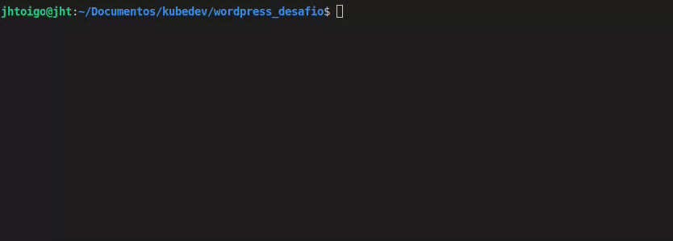
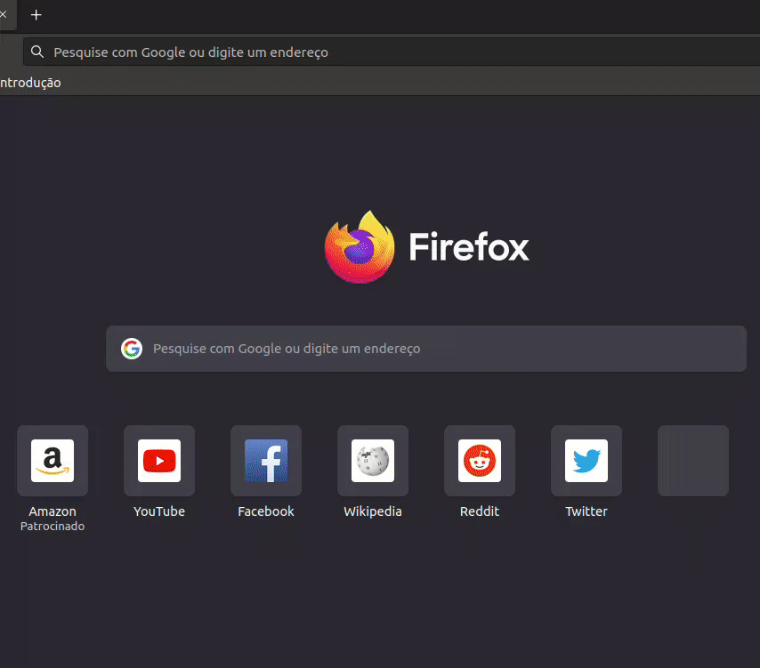

# wordpress_desafio

Para subir o projeto execute o comando

```
docker-compose up -d
```





Para acessar o Wordpress e finalizar as configurações abra o navegador e abra http://localhost:8080 e siga os passos conforme abaixo.

